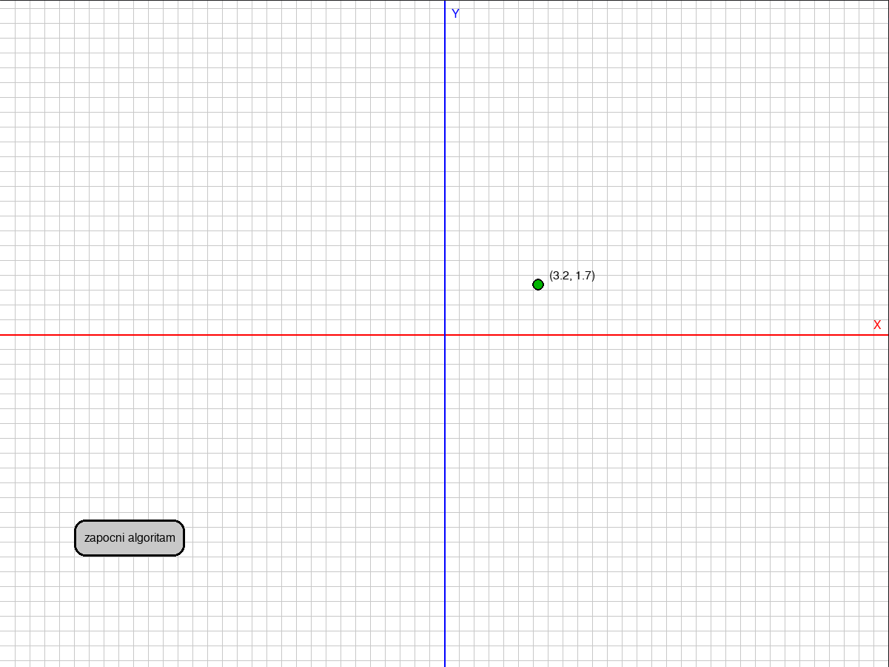
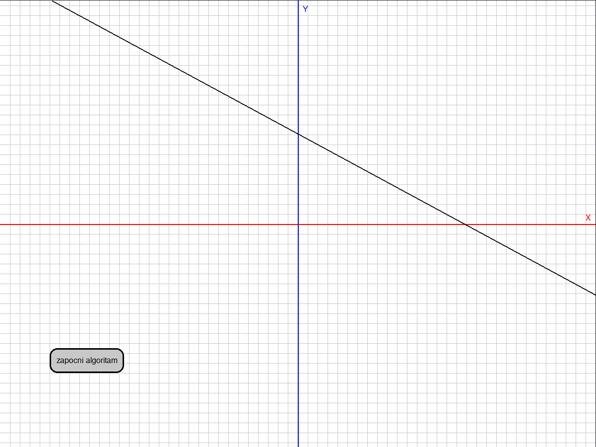
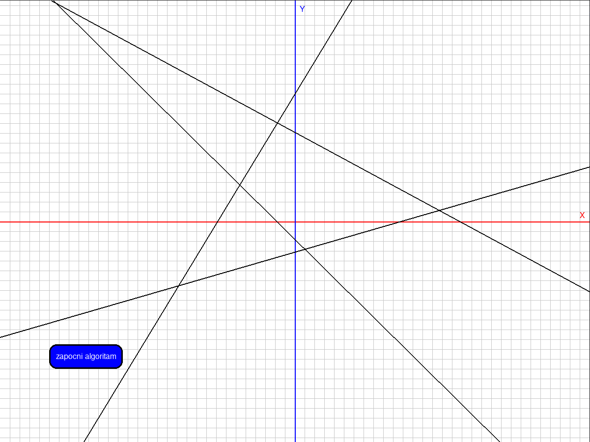
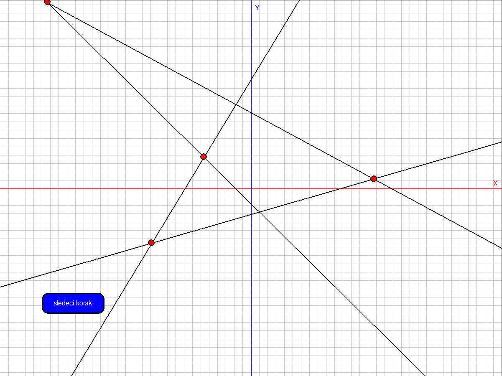
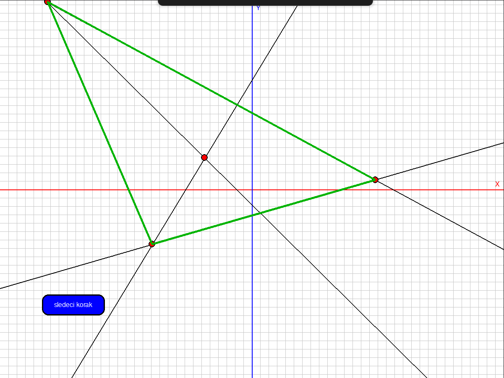

# Convex Hull of Line Intersections

## Project Overview
This project implements an interactive visualization of the **convex hull algorithm** applied to intersections of lines. The program uses PyGame to provide a graphical interface where users can draw lines and observe the step-by-step construction of the convex hull from their intersection points.

## Challenge

Beyond the standard Graham's scan algorithm for finding convex hulls, we face a fundamental problem: identifying the set of points over which to apply Graham's scan.

When dealing with line intersections, the intuitive approach might be to find all intersections and then compute their convex hull. However, with n lines, we could have up to n² intersection points - computing all of them would require O(n²) time.

### The Key Insight

The crucial realization is: we don't need all intersections. With many lines, most intersection points won't be used for the convex hull anyway. What we really need are only the "extreme intersections".

### The Algorithm's Guiding Principle

Consider lines sorted by their angle with the x-axis. If we take two lines that are not adjacent in this sorted sequence, they will intersect, but there will always exist a third line that, due to its intermediate slope, intersects with at least one of them at a point that is more extreme in space.

This means that intersection becomes automatically "more extreme" (farther from the center) through intermediate lines.

### Conclusion

**The most extreme intersections in a sequence of lines sorted by angle with the x-axis are precisely the intersections between adjacent lines in that sorted sequence.**

These adjacent intersections become our critical points.

Through this insight, we've achieved a remarkable reduction:

    From: n² potential intersection points

    To: n critical points

This transforms our approach from a potentially O(n²) operation to a much more efficient O(n log n) process (accounting for the initial sorting).

## Technologies Used
- **Python**
- **PyGame** (for graphical interface)
- **Math module** (for geometric calculations)

## Controls
- Press left mouse button to place a point
  

- If there is a point placed, press left mouse button to make a line between two points
  

- After adding lines you can click "**zapocni algoritam**" button to start algorithm
  

- Click "**sledeci korak**" button to find critical points from all intersections
  

- Keep clicking "**sledeci korak**" button to draw all sides of a convex hull
  

- Press **SPACE** at any time to go back to drawing mode

- While in drawing mode press **R** to reset

- When two lines intersect outside the visible canvas area, the intersection point is projected onto the nearest edge of the visible field. These projected points are displayed in **blue color** to distinguish them from regular intersection points (shown in red).
